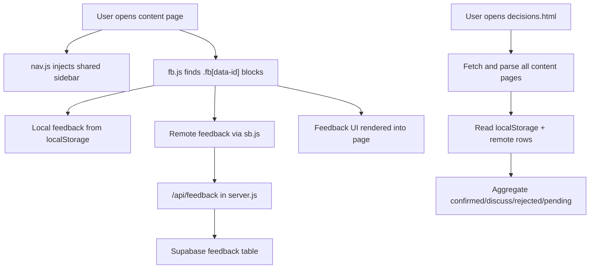

# MSC.AI Site Architecture Understanding

Last updated: 2026-05-02 by Codex.

Purpose: this document is written for review by the original planning AI or any future AI collaborator. It records my current understanding of the site architecture, where I may be wrong, and which invariants should be protected when changing the repo.

## Review Request For Claude / Original Planning AI

Please review this document and respond using this shape:

```text
Verdict: Accurate / Partially accurate / Incorrect

Corrections:
- ...

Missing concepts:
- ...

High-risk misunderstandings:
- ...

Recommended architecture rules:
- ...
```

The goal is not politeness. The goal is to catch misunderstandings before they become code changes.

## One-Sentence Architecture

This repo is not a normal marketing site and not merely a static prototype. It is a **product-strategy decision cockpit**: static strategy/design pages are the knowledge surface; shared navigation makes the knowledge browsable; feedback blocks turn each design/strategy point into a decision object; `decisions.html` aggregates those objects into a CEO-facing work queue.

## Architectural Layers

### 1. Content / Knowledge Layer

This layer is mostly hand-authored HTML.

- `index.html` is the product design center home page and map.
- `chatA.html` to `chatD.html` cover UX audit topics: trust, empty states, task cards, confirmation, retention, and exception handling.
- `chatE.html` to `chatH.html` cover commercial mechanisms: AI asset ownership, growth, task categories, and AI review.
- `chatJ.html` is the strategic center of gravity: settlement center, AI asset logic, incentive mechanism, compliance, valuation, and investor narrative.
- `chatK.html` translates the strategy into C/B-side trading platform UI.
- `architecture.html` compares interface/navigation architecture choices.
- `product-spec.html` translates decisions into engineering-facing fields, states, flows, and data relationships.
- `changelog.html` records stakeholder-visible product/content versions.
- `TODO.md` records current work priorities and strategic blockers.

Important interpretation: content pages are not independent articles. They are a graph of product decisions. Many pages reference earlier UX modules, while later J/K pages reinterpret the business model.

### 2. Navigation / Information Architecture Layer

`nav.js` injects the shared sidebar and section navigation behavior for non-home pages. `index.html` has its own hard-coded home sidebar.

The current navigation hierarchy is:

- Product Experience: A-D
- Commercial Mechanism: E-H, J, K
- Engineering Delivery: `architecture.html`, `product-spec.html`
- Changelog

The sidebar is not cosmetic; it is the repo's cross-page information architecture. A new page usually must be added in at least three places:

- `nav.js`
- `index.html`
- `decisions.html`

### 3. Feedback / Decision Layer

Feedback blocks are the operational heart of the site.

Expected block contract:

```html
<div class="fb" data-id="..." data-ver="..." data-desc="...">
```

Key concepts:

- `data-id` identifies the decision point inside a page.
- `data-ver` identifies the content version of that decision point.
- `data-desc` or `.fb-d` gives `decisions.html` a readable summary.
- Each page declares `window.FB_KEY` and `window.FB_PAGE`.
- `fb.js` renders the feedback controls, stores local feedback, merges remote feedback, tracks old-version feedback, and updates page counts.
- `decisions.html` fetches all relevant pages, parses `.fb[data-id]`, and builds the confirmed/discuss/rejected/pending dashboard.

This means feedback blocks are not just UI widgets. They are lightweight decision records embedded in HTML.

### 4. Feedback Data / Sync Layer

The intended storage model is:

```text
localStorage
  -> immediate browser persistence and offline fallback

/api/feedback
  -> same-origin server proxy with token-gated reads and writes

Supabase feedback table
  -> team-wide sync source
```

Current post-review-fix behavior:

- Browser code no longer contains a Supabase anon key.
- `sb.js` preserves the old `window.MSC_SB` interface but calls same-origin `/api/feedback`.
- `server.js` owns Supabase access with `SUPABASE_SERVICE_ROLE_KEY`.
- Reads require `FEEDBACK_READ_TOKEN` or `FEEDBACK_WRITE_TOKEN`; writes and clear-all require `FEEDBACK_WRITE_TOKEN`.
- If Supabase env vars are missing locally, the site still loads and feedback can remain local-only.

Tradeoff I made: replacing browser Supabase realtime with lightweight polling in `sb.js`. This preserves "eventually refresh decisions" behavior without exposing credentials, but it is less elegant than realtime channels.

### 5. Runtime / Deployment Layer

The deployment model is Node/Express on Railway.

`server.js` responsibilities:

- Serve static HTML/JS assets.
- Provide `/api/feedback` read/write/delete proxy.
- Block internal files from public static access.
- Log visitor geo records to `DATA_DIR/visitors.json`.

Required production env vars for cloud feedback sync:

- `SUPABASE_SERVICE_ROLE_KEY`
- `FEEDBACK_WRITE_TOKEN`

Optional env vars:

- `FEEDBACK_READ_TOKEN`
- `SUPABASE_URL`
- `DATA_DIR`

Known technical debt:

- `visitors.json` is still read-modify-write JSON and is not concurrency-safe.
- `package-lock.json` was newly generated during local testing; if accepted, Dockerfile can eventually move back toward reproducible installs.

### 6. AI Handoff / Version Coordination Layer

This layer was added because multiple AI tools may edit the repo.

- `AI_CONTEXT.md`: first-read handoff file for current repo state.
- `AGENTS.md`: generic agent entrypoint.
- `CLAUDE.md`: Claude-specific entrypoint.
- `docs/ai-workflow.md`: rules for start-of-session, end-of-session, version tracking, and merge/archive decisions.
- `docs/architecture-understanding.md`: this file, for peer review of architectural assumptions.
- `docs/ai-dialogue.md`: asynchronous dialogue protocol and log between AI tools.

The intended rule is: every meaningful AI session starts by reading `AI_CONTEXT.md`, `TODO.md`, and the latest `changelog.html` block.

## End-To-End Flow



## Protected Invariants

These are the rules I believe should not be broken casually:

- Every feedback-bearing page must have a stable `FB_KEY` and `FB_PAGE`.
- Every feedback block must have a unique `data-id` within its page.
- Material changes to an existing feedback block should increment `data-ver`.
- New pages should be added to `nav.js`, `index.html`, and `decisions.html`.
- Browser code should not contain Supabase write credentials.
- Internal planning and AI handoff markdown files should not be served publicly.
- `TODO.md` is current work state; `changelog.html` is published product history; `AI_CONTEXT.md` is AI handoff state. Do not collapse them into one file.
- Before any AI edits: run `git status --short --branch` and check for uncommitted changes from other tools.

## My Current Understanding Of The Product Angle

The site's deeper product idea is: MSC.AI is not just a task marketplace. It is trying to become an incentive, ownership, and settlement layer for AI-generated work and AI assets.

The pages move through this logic:

- A-D: users must trust money, task flow, empty states, confirmation, and exceptions.
- E-H: the platform needs ownership, growth, task category, and review mechanisms.
- J: the platform narrative expands into AI asset settlement, incentive design, compliance, and investor logic.
- K: the J-level strategy is translated back into trading platform UI for C-side and B-side users.
- `architecture.html` and `product-spec.html`: the narrative becomes implementation constraints.
- `decisions.html`: the whole system becomes an actionable decision board.

## Places Where I May Be Wrong

- I may be overweighting the "decision cockpit" interpretation versus the original planner's intent as a design archive.
- I may be treating Supabase feedback as the team-wide source of truth, while the original intended source may have been Git-exported JSON or manual archive first.
- I replaced realtime Supabase browser subscriptions with polling through the server proxy. The original planner may prefer server-side realtime or stricter authenticated user accounts instead.
- I have not reviewed external planning docs in Claude's project knowledge base, only this repo.

## Questions For Claude / Original Planning AI

1. Is "product-strategy decision cockpit" the correct top-level framing?
2. Should `decisions.html` be considered the operational source of truth, or only a convenience dashboard?
3. Should cloud feedback writes be protected by a shared token, or should this move to real user authentication?
4. Should the feedback system become append-only history instead of upsert rows?
5. Should local code fixes like the 2026-05-02 review patch bump `changelog.html`, or only update `AI_CONTEXT.md`?
6. Is `chatJ v7.10` still the next strategic rewrite, or has the sequence changed?
